# TP 1 : Create a git project

This TP explores Git basics: initializing a repository, tracking files, making commits, handling sensitive data with .gitignore, and pushing changes to GitHub for version control practice.


## Step 1 : Initializing the repository

I created a folder called `tp-git` and opened it in VSCode. Before running `git init`, I tested `git status` to see what would happen — Git returned a fatal error since the folder wasn't a repository yet.


I then ran `git init`, which created an empty Git repository. Running `git status` right after confirmed we're now on branch `master` with no commits yet.

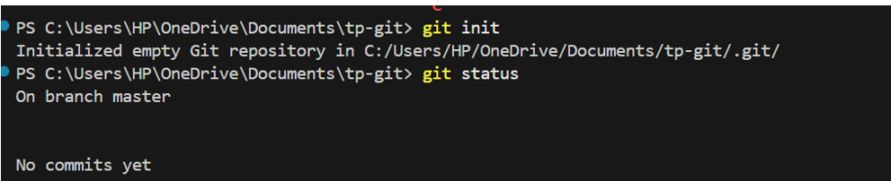


## Step 2 : Tracking files

I created two files, `f1` and `f2`. After running `git add f1`, the file was staged and appeared under "Changes to be committed". `f2` remained untracked at this point.

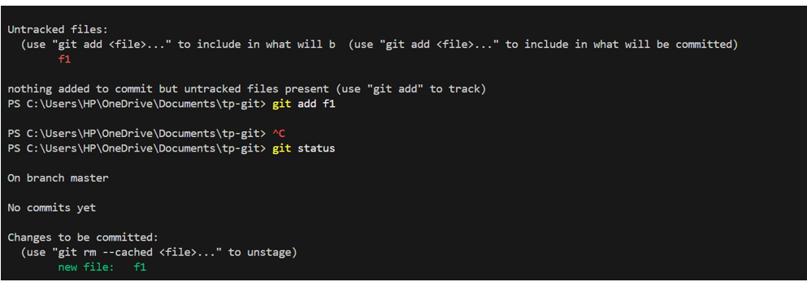


## Step 3 : First commit

With `f1` staged and `f2` still untracked, I made my first commit with the message `"initial commit"`. After the commit, `git status` showed `f2` still listed as untracked — only `f1` was saved in this snapshot.

I then ran `git log` to verify the commit was recorded, showing my name, email, and the commit date.

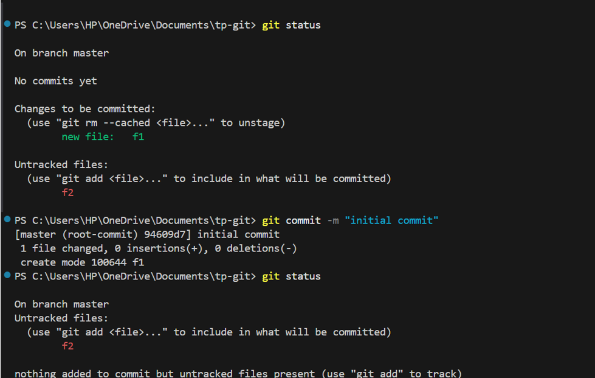

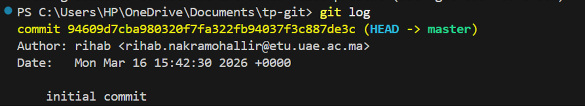


## Step 4 : Second commit

I staged `f2` using `git add -A` to add all remaining files at once, then committed with the message `"2nd commit f2"`. After the commit, `git status` showed nothing left to commit.

Running `git log` now showed both commits in the history.

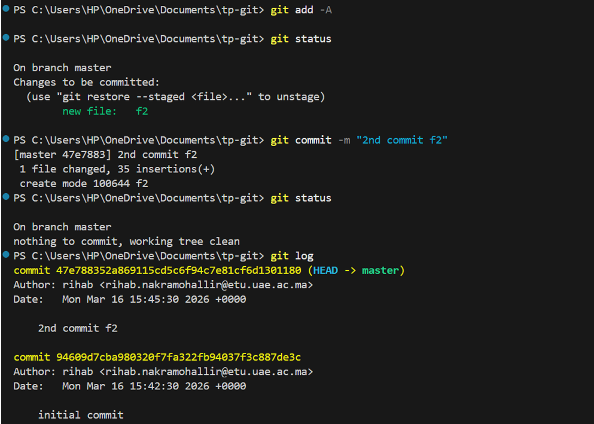


## Step 5 : Adding a credentials file

I created a `credentials.txt` file with fake login info. I noticed that running `git commit` without staging first didn't work — the file was still untracked. I then used `git add -A` before committing with the message `"credentials commit"`.

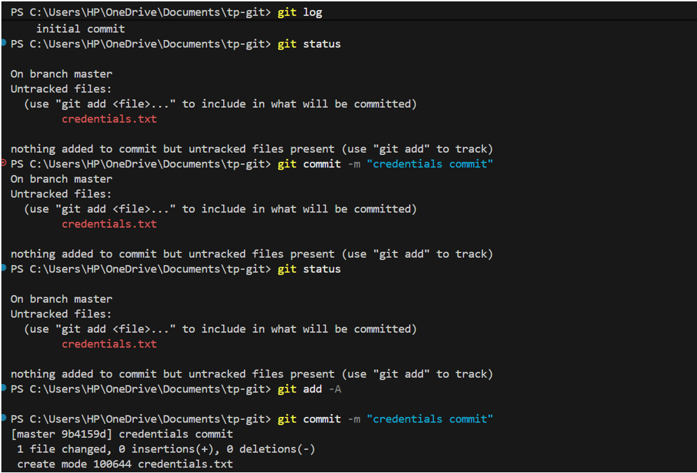

Running `ls` confirmed all files were present in the directory, including `credentials.txt`.

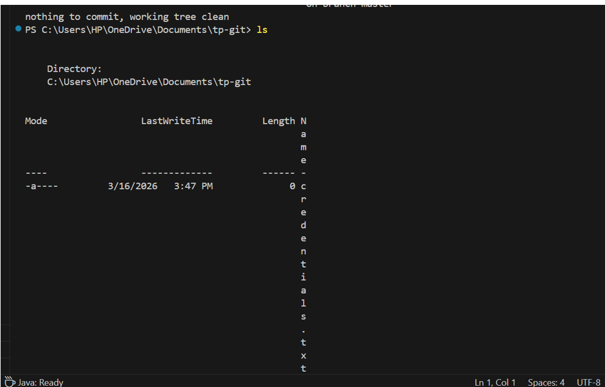


## Step 6 : Removing credentials and setting up .gitignore

Since committing sensitive files to a remote repo is a security risk, I removed `credentials.txt` from Git tracking using `git rm credentials.txt`. Then I created a `.gitignore` file using:

```bash
echo "credentials.txt" > .gitignore
```

After running `git add -A`, the status showed `.gitignore` as a new file and `credentials.txt` as deleted — both staged and ready to commit.

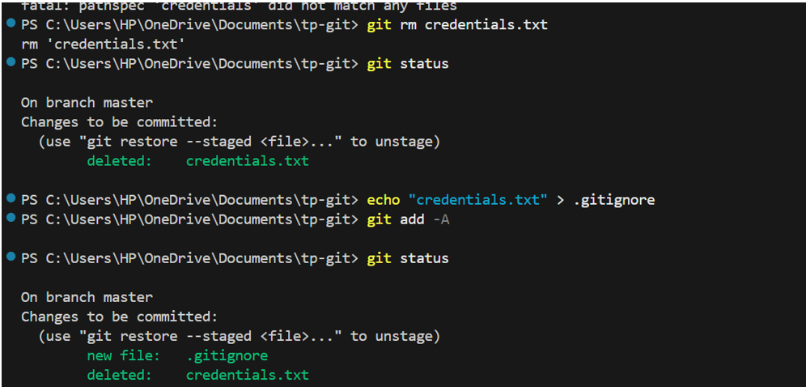

I committed with the message `"ignore credentials"`. The working tree was clean afterwards.

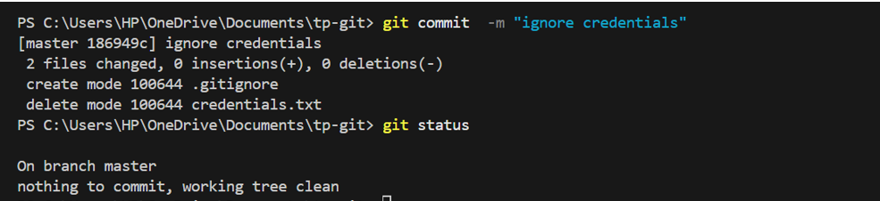

I re-created `credentials.txt` to test the `.gitignore` — running `git status` showed it as untracked but ignored, confirming the `.gitignore` was working correctly.

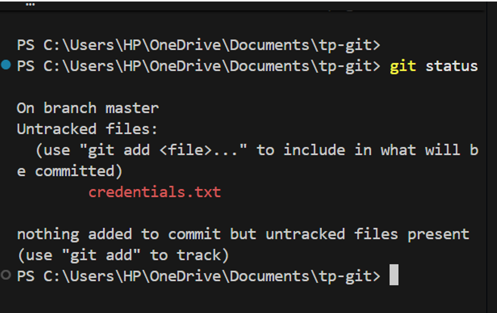


## Step 7 : Pushing to GitHub

I created a repository on GitHub and linked it to my local repo:

```bash
git remote add origin https://github.com/rihabchk/tp-git.git
```


I then pushed all commits to GitHub with:

```bash
git push -u origin master
```

All 11 objects were transferred successfully and the `master` branch was set up to track `origin/master`.

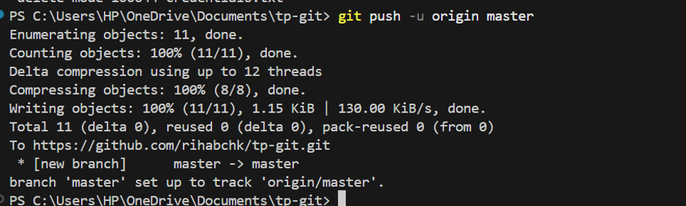
